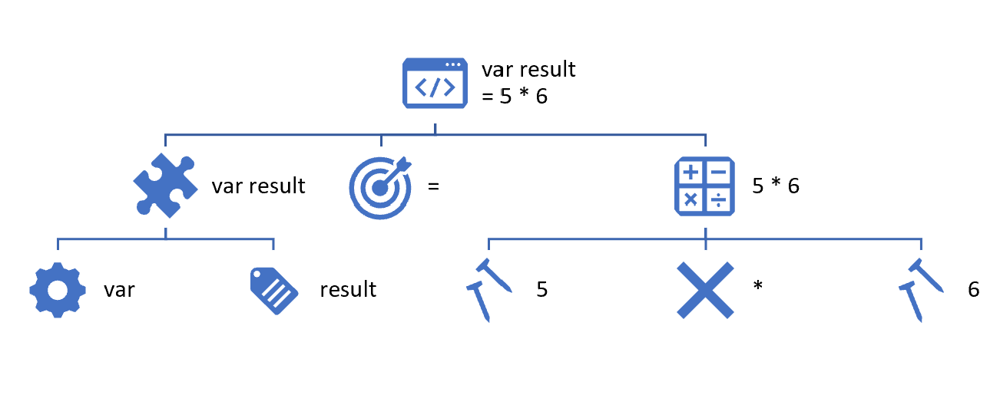
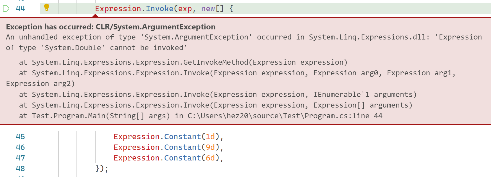
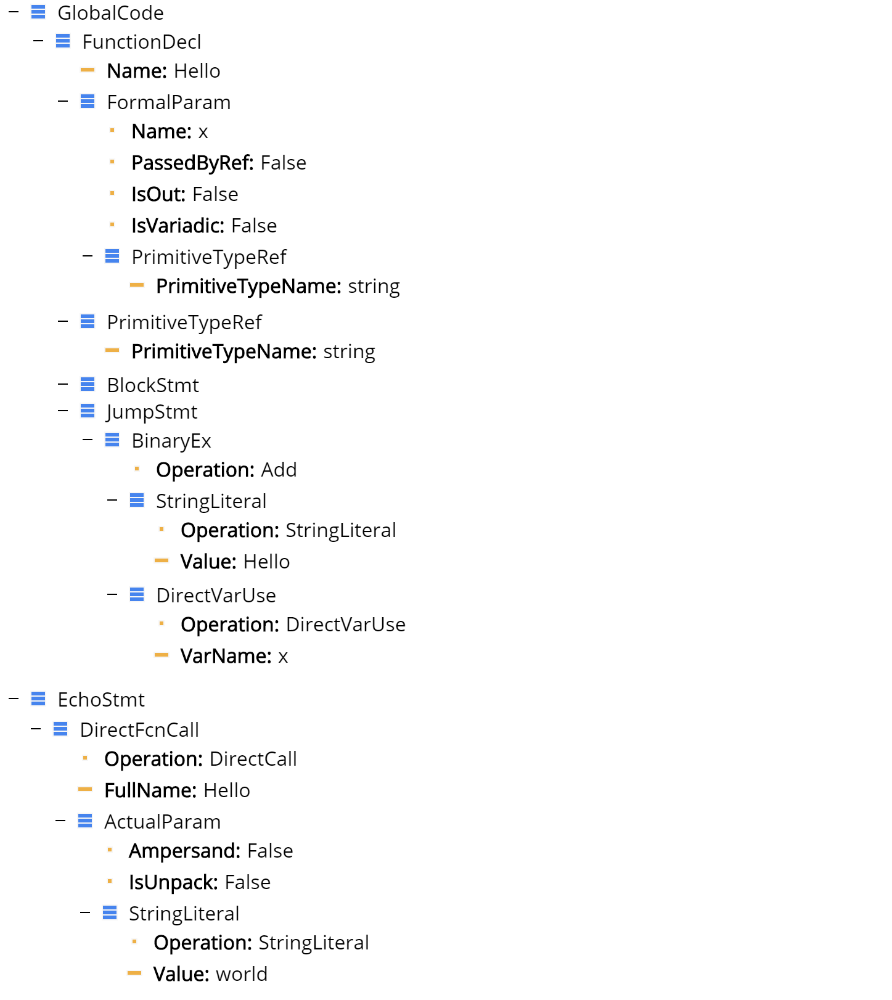

# Expressions and Dynamic Language Runtime
Enze He
11/17/2019

---
# .NET Platform
## .NET Core
A free, cross-platform and open-source development platform.
https://dot.net/

Available Languages: C#, F#, VB.NET, [PHP, Python]...

[...]: Non-official supports

---
# A Brief View of .NET Core
- What is .NET Core
- What can we do on .NET Core

---
# Ability
- Web
- Mobile
- Desktop
- Microservices
- Gaming
- Machine Learning
- Cloud
- Internet of Things
- ...

---
# Web
## ASP.NET Core
- Traditional Web Server
- API Server
- Instant Messaging Server: SignalR
- RPC Server: gRPC
- Single Page Web App: Blazor

---
# Mobile
## Xamarin
- Xamarin Native
- Xamarin.Forms

## Avalonia

## Applys to
Android, iOS, Windows Phone

---
# Desktop
- UWP (Windows Only)
- WPF (Windows Only)
- Windows Forms (Windows Only)
- Xamarin
- Avalonia

## Applys to
Windows, macOS, Linux

---
# Microservices
ASP.NET Core

## Container Technologies
- Docker
- Windows Container

## Container-compose Technologies
- Kubernetes (k8s)
- Service Fabric

---
# Gaming
- Unity
- MonoGame
- CRYENGINE

## Unity
Some examples: 
- 王者荣耀、神庙逃亡、炉石传说、暗影之枪...

---
# Machine Learning
- ML.NET
- Tensorflow.NET
- Keras.NET
- CNTK

## Somethings need to be considered
- High-level abstraction
- Easy with data processing
- Immutability and parallelizing

---
# Cloud

## Provider
- Azure
- AWS
- Google Cloud
- ...

## Forms
- On servers
- Server-less services: BaaS, FaaS

---
# Internet of Things (IoT)
- UWP
- Edge Computing
- Boards: Jetson TX, Raspberry Pi, Intel Development Boards...

---
# Dynamic Language Runtime
> A runtime environment that adds a set of services for dynamic languages to the common language runtime
### Examples of dynamic languages
Lisp, Smalltalk, JavaScript, PHP, Ruby, Python, ColdFusion, Lua, Cobra, and Groovy...

---
# Why are dynamic languages so attractive?
- REPL (Read-Evaluate-Print Loop)
- Support for both top-down development and more traditional bottom-up development.
- Easier refactoring and code modifications

---
# Expressions
## What is expression?
```csharp
var result = 5 * 6;
```

---
## Expression Tree


---
## A more complicated example
$$
\frac {-B + \sqrt{B \times B - 4 \times A \times C}} {2 \times A}
$$

### Lambda Expression
```csharp
(A, B, C) => (-B + Math.Sqrt(B * B - 4 * A * C)) / (2 * A);
```

---
## Build Expression

### Some common things first
```csharp
// some common constants
var zero = Expression.Constant(0d);
var two = Expression.Constant(2d);
var four = Expression.Constant(4d);

// some parameters
var a = Expression.Parameter(typeof(double), "A");
var b = Expression.Parameter(typeof(double), "B");
var c = Expression.Parameter(typeof(double), "C");
```
---
### Expression Body
```csharp
var exp = Expression.Add( // For more generic purpose, use Expression.MakeBinary()
    Expression.Subtract(zero, b),
    Expression.Divide(
        Expression.Call(
            typeof(Math), nameof(Math.Sqrt), null,
            Expression.Subtract(
                Expression.Multiply(
                    b,
                    b),
                Expression.Multiply(
                    four,
                    Expression.Multiply(
                        a,
                        c)))),
        Expression.Multiply(
            two,
            a)));
```

---
## What if invoking the expression, and why?
```csharp
Expression.Invoke(exp, new[] { Expression.Constant(1d), Expression.Constant(9d), Expression.Constant(6d) });
```


---
## Create a delegate from a lambda expression
```csharp
var compute = (Func<double, double, double, double>)
    Expression.Lambda(exp, false, 
        new[] { a, b, c })
    .Compile();

Console.WriteLine(compute(1, 9, 6));
// output: -5.225082782364625 
```
### Lambda -> Delegate: Dynamic IL Generation
---
## Consider this lambda
```csharp
n => 
{
    var res = 1;
    while (n > 1)
    {
        res = res * n;
        n--;
    }
    return res;
};
```
---
## Dynamic generation
```csharp
var nArgument = Expression.Parameter(typeof(int), "n");
var result = Expression.Variable(typeof(int), "result");
// Creating a label that represents the return value
var label = Expression.Label(typeof(int));
var initializeResult = Expression.Assign(result, Expression.Constant(1));
// This is the inner block that performs the multiplication, and decrements the value of 'n'
var block = Expression.Block(
    Expression.Assign(result,
        Expression.Multiply(result, nArgument)),
    Expression.PostDecrementAssign(nArgument));
// Creating a method body.
var body = Expression.Block(
    new[] { result },
    initializeResult,
    Expression.Loop(
        Expression.IfThenElse(
            Expression.GreaterThan(nArgument, Expression.Constant(1)),
            block,
            Expression.Break(label, result)),
        label));
// create lambda
var func = (Func<int, int>)Expression.Lambda(body, false, nArgument).Compile();
Console.WriteLine(func(5));
// output: 120
```
---
### Expression is immutable, but it can be transformed.

---
# Dynamic Object
- IDynamicMetaObjectProvider
- DynamicMetaObject
- DynamicObject
- ExpandoObject

---
## IDynamicMetaObjectProvider
```csharp
DynamicMetaObject GetMetaObject(Expression expression);
```
Get the DynamicMetaObject responsible for binding operations performed on an object.

---
## DynamicMetaObject
Dynamic binding and a binding logic of an object participating in the dynamic binding.

| Property | Explanation |
| -- | -- |
| Expression | The expression of DynamicMetaObject during dynamic binding. |
| HasValue | Whether the DynamicMetaObject has the runtime value. |
| LimitType | Limit type of the DynamicMetaObject. |
| Restrictions | The set of binding restrictions under which the binding is valid. |
| RuntimeType | Type of the runtime value. |
| Value | The runtime value. |

---
### Overrides
```csharp
DynamicMetaObject BindBinaryOperation(BinaryOperationBinder binder, DynamicMetaObject value);
DynamicMetaObject BindConvert(ConvertBinder binder);
DynamicMetaObject BindCreateInstance(CreateInstanceBinder binder, DynamicMetaObject[] values);
DynamicMetaObject BindDeleteIndex(DeleteIndexBinder binder, DynamicMetaObject[] indexes);
DynamicMetaObject BindDeleteMember(DeleteMemberBinder binder);
DynamicMetaObject BindGetIndex(GetIndexBinder binder, DynamicMetaObject[] indexes);
DynamicMetaObject BindGetMember(GetMemberBinder binder);
DynamicMetaObject BindInvoke (InvokeBinder binder, DynamicMetaObject[] args);
DynamicMetaObject BindInvokeMember (InvokeMemberBinder binder, DynamicMetaObject[] args);
DynamicMetaObject BindSetIndex (SetIndexBinder binder, DynamicMetaObject[] indexes, DynamicMetaObject value);
DynamicMetaObject BindSetMember (SetMemberBinder binder, DynamicMetaObject value);
DynamicMetaObject BindUnaryOperation (UnaryOperationBinder binder);
DynamicMetaObject Create (object value, Expression expression);
IEnumerable<string> GetDynamicMemberNames();
```
### Examples

---
## DynamicObject
Provides a base class for specifying dynamic behavior at run time.

### Examples

---
## ExpandoObject
Represents an object whose members can be dynamically added and removed at run time.

### Examples

---
# Call site caching
- L0 Cache: CallSite’s Target Delegate
- L1 Cache: CallSite’s Rule Set
- L2 Cache: Combined Rule Sets of All Equivalent CallSites

---
# Dynamic Language Implementation on .NET
### Example

---
## Components:
- Lexer.cs: text -> tokens
- Parser.cs: tokens -> Abstract Syntax Tree (AST)
- ExpressionTreeGenerator.cs: AST -> Expression Trees
- Runtime.cs: runtime binders, helper functions, dynamic object helpers, built-in types...
- Language.cs: holds the language hosting class which you instantiate to run PHP code
- Program.cs: used for REPL

---
## A brief view of the process
```php
<?php

function Hello(string $x) : string {
    return "Hello " + $x;
}

echo Hello("world");
```

---
## AST


---
## AST -> Expression -> IL code generation

---
## Benefits
- Implement your own dynamic language
- JIT and GC support on .NET Core
- More performance improvements by 3 levels caching
- Easy to implement, easy to expand
- Two-way introperative ability between language and .NET Core
### Example
Python or IronPython?

---
# Thanks for listening