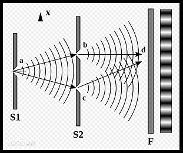
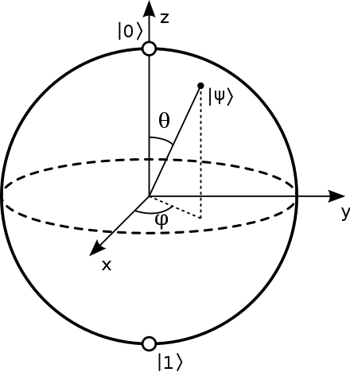

<style>
section {
  font-family: 'DengXian';
}
</style>


# A Brief Introduction to Quantum Computing with Q#

Sun Yat-sen University - Microsoft Student Club
Enze He

2021/4/11

---
# 量子计算机

利用量子的物理属性来进行计算。

由于量子的三大特性：叠加、干涉和纠缠，可以为一些计算任务提供指数级别的加速。

量子计算机都是概率计算机。

---

# 薛定谔 (Schrödinger) 方程

$$ i \hbar \frac{\partial}{\partial t}\psi(t) = \hat H \psi(t) $$

$\psi(t)$: 波函数，表示量子系统的状态
$\hat H$: 哈密顿算子，表示系统能量
$\hbar$: 普朗克常数
$t$: 时间

---

**薛定谔方程决定了系统状态如何演变，由波函数 $\psi$ 表示。**

$$ i \hbar \frac{\partial}{\partial t}\psi(t) = \hat H \psi(t) $$

给定时间 $t$，可通过薛定谔等式确定系统状态。

每个波函数 $\psi$ 都与其概率振幅相关。

---

## 双缝实验和概率振幅



波函数 $\psi(x,y,z,t)$

复概率（测量：$P = |\psi|^2 = \psi\psi^*$）

双缝实验分别得到概率分布 $P_1$，$P_2$，如何表示 $P_{12}$？

- 叠加概率振幅：$P_{12}=|\psi_1 + \psi_2|^2$

---

# 量子叠加

薛定谔方程是一个线性方程，薛定谔方程（即有效量子态）的解的任意线性组合也是有效量子态，这种线性组合称为叠加。

---

# 概率计算机

量子计算机中的程序本质上是概率性质的，而传统计算机通常是确定性的，量子算法包括应用于量子位寄存器的线性运算，用于将状态修改为所有可能的状态的一种特定叠加。

每个可能的状态都具有关联的概率振幅，在进行测量时，将获得一个具有一定概率的可能状态。不像传统计算机那样一个位只能是确定的 0 或 1。

因此有时你需要多次运行算法，确保概率最高的结果。

---

# A Simple Review on Linear Algebra

---

# Vectors and Matrices
## Vectors

$$v =\begin{bmatrix}
v_1\\
v_2\\
\vdots\\
v_n
\end{bmatrix}$$

### Norm
$\sqrt{\sum_i |v_i|^2}$
Unit norm (unit vector): if its norm is $1$

---

### Adjoint of a vector
$$v^\dagger = \begin{bmatrix}v_1 \\ \vdots \\ v_n \end{bmatrix}^\dagger = \begin{bmatrix}v_1^* & \cdots & v_n^* \end{bmatrix}$$

### Inner product
$$
\langle u, v\rangle = u^\dagger v=u_1^{*} v_1 + \cdots + u_n^{*} v_n
$$

### Liner property
$$\mathrm{If}~u =\begin{bmatrix}
u_1\\
u_2\\
\vdots\\
u_n
\end{bmatrix}~\mathrm{and}~
v =\begin{bmatrix}
	v_1\\
	v_2\\
	\vdots\\
	v_n
\end{bmatrix},~\mathrm{then}~
au+bv =\begin{bmatrix}
au_1+bv_1\\
au_2+bv_2\\
\vdots\\
au_n+bv_n
\end{bmatrix}
$$

---

## Matrices
$$M = 
\begin{bmatrix}
M_{11} ~~ M_{12} ~~ \cdots ~~ M_{1n}\\
M_{21} ~~ M_{22} ~~ \cdots ~~ M_{2n}\\
\ddots\\
M_{m1} ~~ M_{m2} ~~ \cdots ~~ M_{mn}\\
\end{bmatrix}$$

### Multiplication
$$
\begin{bmatrix}
	M_{11} ~~ M_{12} ~~ \cdots ~~ M_{1n}\\
	M_{21} ~~ M_{22} ~~ \cdots ~~ M_{2n}\\
	\ddots\\
	M_{m1} ~~ M_{m2} ~~ \cdots ~~ M_{mn}
\end{bmatrix}
\begin{bmatrix}
N_{11} ~~ N_{12} ~~ \cdots ~~ N_{1p}\\
N_{21} ~~ N_{22} ~~ \cdots ~~ N_{2p}\\
\ddots\\
N_{n1} ~~ N_{n2} ~~ \cdots ~~ N_{np}
\end{bmatrix}=\begin{bmatrix}
P_{11} ~~ P_{12} ~~ \cdots ~~ P_{1p}\\
P_{21} ~~ P_{22} ~~ \cdots ~~ P_{2p}\\
\ddots\\
P_{m1} ~~ P_{m2} ~~ \cdots ~~ P_{mp}
\end{bmatrix}
$$

where $P_{ik} = \sum_j M_{ij}N_{jk}$

---

### Identity matrix
$$\bold{1}=\begin{bmatrix}
1 ~~ 0 ~~ \cdots ~~ 0\\
0 ~~ 1 ~~ \cdots ~~ 0\\
~~ \ddots\\
0 ~~ 0 ~~ \cdots ~~ 1
\end{bmatrix}$$

### Inverse matrix

An inverse matrix $B$, if $AB = BA = \bold{1}$. Denote $B$ as $A^{-1}$. 

### Unitary matrix

$U$, if $UU^\dagger = U^\dagger U = \bold{1}$ or equivalently, $U^{-1} = U^\dagger$. 

An important property: preserving the norm of a vector

$$\langle v,v \rangle=v^\dagger v = v^\dagger U^{-1} U v = v^\dagger U^\dagger U v = \langle U v, U v\rangle.$$

---

### Tensor product (Kronecker product)
$$
M \otimes N =
\begin{bmatrix}
	M_{11} ~~ \cdots ~~ M_{1n} \\
	\ddots\\
	M_{m1}  ~~ \cdots ~~ M_{mn}
\end{bmatrix}
\otimes
\begin{bmatrix}
	N_{11}  ~~ \cdots ~~ N_{1q}\\
	\ddots\\
	N_{p1} ~~ \cdots ~~ N_{pq}
\end{bmatrix}\\
=
\begin{bmatrix}
	M_{11} \begin{bmatrix} N_{11}  ~~ \cdots ~~ N_{1q}\\ \ddots\\ N_{p1} ~~ \cdots ~~ N_{pq} \end{bmatrix}~~ \cdots ~~ 
	M_{1n} \begin{bmatrix} N_{11}  ~~ \cdots ~~ N_{1q}\\ \ddots\\ N_{p1} ~~ \cdots ~~ N_{pq} \end{bmatrix}\\
	\ddots\\
	M_{m1} \begin{bmatrix} N_{11}  ~~ \cdots ~~ N_{1q}\\ \ddots\\ N_{p1} ~~ \cdots ~~ N_{pq} \end{bmatrix}~~ \cdots ~~ 
	M_{mn} \begin{bmatrix} N_{11}  ~~ \cdots ~~ N_{1q}\\ \ddots\\ N_{p1} ~~ \cdots ~~ N_{pq} \end{bmatrix}
	\end{bmatrix}
$$

---

### Repeated tensor product
For any vector $v$ or matrix $M$, $v^{\otimes n}$ or $M^{\otimes n}$ is short hand for an $n$-fold repeated tensor product.

$$
\begin{bmatrix} 1 \\ 0 \end{bmatrix}^{\otimes 1} = \begin{bmatrix} 1 \\ 0 \end{bmatrix}, \qquad\begin{bmatrix} 1 \\ 0 \end{bmatrix}^{\otimes 2} = \begin{bmatrix} 1 \\ 0 \\0 \\0 \end{bmatrix}, \qquad\begin{bmatrix} 1 \\ -1 \end{bmatrix}^{\otimes 2} = \begin{bmatrix} 1 \\ -1 \\-1 \\1 \end{bmatrix},
\\
\begin{bmatrix}	0 & 1 \\ 1& 0 	\end{bmatrix}^{\otimes 1}= \begin{bmatrix}	0& 1 \\ 1& 0 	\end{bmatrix},	\qquad\begin{bmatrix}	0 & 1 \\ 1& 0 	\end{bmatrix}^{\otimes 2}= \begin{bmatrix} 0 &0&0&1 \\ 0 &0&1&0 \\ 0 &1&0&0\\ 1 &0&0&0\end{bmatrix}
$$

---

### Eigenvalues and Eigenvectors
Let $M$ be a square matrix and $v$ be a vector that is not the all zeros vector (i.e., the vector with all entries equal to $0$).

$v$ is an eigenvector of $M$ if $Mv = cv$, while $c$ is the eigenvalue corresponding to the eigenvector $v$. 

In general a matrix $M$ may transform a vector into any other vector, but an eigenvector is special because it is left unchanged except for being multiplied by a number. 

Note that if $v$ is an eigenvector with eigenvalue $c$, then $av$ is also an eigenvector (for any nonzero $a$) with the same eigenvalue.

---

### Some examples
For identity matrix, every vector $v$ is an eigenvector with eigenvalue $1$.

For a diagonal matrix $D$,

$$ \begin{bmatrix} d_1 & 0 & 0 \\ 0 & d_2 & 0 \\ 0 & 0 & d_3 \end{bmatrix} $$

The vectors

$$\begin{bmatrix}1 \\ 0 \\ 0 \end{bmatrix}, \begin{bmatrix}0 \\ 1 \\ 0\end{bmatrix} and \begin{bmatrix}0 \\ 0 \\ 1\end{bmatrix}$$

are eigenvectors of this matrix with eigenvalues $d_1$, $d_2$, and $d_3$, respectively.

---

### Some complex matrices
#### Hermitian matrix

A complex square matrix equal to its own complex conjugate transpose.

$A=\bar{A^{\dagger}}=A^H, a_{ij}=\bar{a_{ji}}$

#### Unitary matrix
A complex square matrix $U$ is unitary if its conjugate transpose $U^*$ is also its inverse.

$U^{\dagger}U=UU^{\dagger}=I$

---

### Spectral theorem
For any Hermitian or unitary matrix $M$, there exists a unitary $U$ such that $M=U^\dagger D U$, where $D$ is a diagonal matrix.

Furthermore, the diagonal entries of $D$ will be the eigenvalues of $M$.

Therefore, if $v$ is an eigenvector of $D$ with eigenvalue $c$, i.e., $Dv = cv$, then $U^\dagger v$ will be an eigenvector of $M$ with eigenvalue $c$.

$$M(U^\dagger v) = U^\dagger D U (U^\dagger v) =U^\dagger D (U U^\dagger) v = U^\dagger D v = c U^\dagger v$$

---

### Matrix Exponentials

$$ e^A=\bold{1} + A + \frac{A^2}{2!}+\frac{A^3}{3!}+\cdots $$

This is important because quantum mechanical time evolution is described by a unitary matrix of the form $e^{iB}$ for Hermitian matrix $B$. For this reason, performing matrix exponentials is a fundamental part of quantum computing.

#### How to compute?
- Approximating
- Cleve Moler and Charles Van Loan. "Nineteen dubious ways to compute the exponential of a matrix." SIAM review 20.4 (1978): 801-836
- https://doi.org/10.1137/S00361445024180

---

#### Understand

With spectral theorem: for every Hermitian or unitary matrix $A$ there exists a unitary matrix $U$ and a diagonal matrix $D$ such that $A=U^\dagger D U$.

So we have $A^2 = U^\dagger D^2 U$ and similarly for any power $p$ $A^p = U^\dagger D^p U$.

$$ e^A= U^\dagger \left(\bold{1} +D +\frac{D^2}{2!}+\cdots \right)U= U^\dagger \begin{bmatrix}e^{D_{11}} & 0 &\cdots &0\\ 0 & e^{D_{22}}&\cdots& 0\\ \vdots &\vdots &\ddots &\vdots\\ 0&0&\cdots&e^{D_{NN}} \end{bmatrix} U $$

Transforming to the eigenbasis of the matrix $A$ => computing the matrix exponential is equivalent to computing the ordinary exponential of the eigenvalues of the matrix.

---

### Another useful property
If $B$ is both unitary and Hermitian, i.e., $B=B^{-1}=\bar{B^\dagger}$, then $B^2=\bold{1}$.

e.g.
$$
\begin{bmatrix} \cos\theta & \sin\theta \\ \sin\theta & -\cos\theta \end{bmatrix} \text{ or } \begin{bmatrix} \cos\theta & i\sin\theta \\ -i\sin\theta & -\cos\theta \end{bmatrix} \text{ or } \begin{bmatrix} \pm 1 & 0 \\ 0 & \pm 1 \end{bmatrix}
$$
By applying this rule to the above expansion of the matrix exponential and by grouping the $\bold{1}$ and the $B$ terms together, for any real value $x$ we have:
$$e^{iBx}=\bold{1} \cos(x)+ iB\sin(x)$$

---

### Alternative explanation to above identity
$$ e^x = 1 + \frac{x}{1!} + \frac{x^2}{2!} + \frac{x^3}{3!} + ... $$

$$ \cos{x} = 1 - \frac{x^2}{2!} + \frac{x^4}{4!} - \frac{x^6}{6!} ... $$

$$ \sin{x} = x - \frac{x^3}{3!} + \frac{x^5}{5!} - \frac{x^7}{7!} ... $$

$$ e^{iBx}=\bold{1} \cos(x)+ iB\sin(x) $$

It allows to reason about the actions matrix exponentials have, which is especially useful, for the case when $B$ is both unitary and Hermitian, even if the dimension of $B$ is exponentially large.

---

# 量子位: Qubit

- 表示
- 测量
- 操作

---

## Qubit 表示

二进制：$0$、$1$

Qubit 可以是 $0$ 和 $1$ 任何一个，或者是他们的叠加。

Qubit 的状态：一个二维单位向量，叫做量子状态向量。

$\begin{bmatrix} \alpha \\ \beta \end{bmatrix}$，$\alpha$ 和 $\beta$ 都是复数， $|\alpha|^2 + |\beta|^2 = 1$. 

例如：
$$\begin{bmatrix} 1 \\ 0 \end{bmatrix}, \begin{bmatrix} 0 \\ 1 \end{bmatrix}, \begin{bmatrix} \frac{1}{\sqrt{2}} \\ \frac{1}{\sqrt{2}} \end{bmatrix}, \begin{bmatrix} \frac{1}{\sqrt{2}} \\ \frac{-1}{\sqrt{2}} \end{bmatrix}, \text{ 和 }\begin{bmatrix} \frac{1}{\sqrt{2}} \\ \frac{i}{\sqrt{2}} \end{bmatrix}.$$

---

## Qubit 中的 $0$ 和 $1$

$$0\equiv \begin{bmatrix} 1 \\ 0 \end{bmatrix}, \qquad 1 \equiv \begin{bmatrix} 0 \\ 1 \end{bmatrix}$$

用向量空间来描述量子位状态：

$$ \begin{bmatrix} x \\ y \end{bmatrix} = x \begin{bmatrix} 1 \\ 0 \end{bmatrix} + y \begin{bmatrix} 0 \\ 1 \end{bmatrix} $$

---

## 测量："Looking at a qubit"

使量子状态坍塌到 $\begin{bmatrix} 1 \\ 0 \end{bmatrix}$ 和 $\begin{bmatrix} 0 \\ 1 \end{bmatrix}$ 之一。测量将导致量子坍塌，将不确定性变为确定。

$\begin{bmatrix} \alpha \\ \beta \end{bmatrix}$ 的测量结果：

有 $|\alpha|^2$ 的概率是 $0$，$|\beta|^2$ 的概率是 $1$。

$|\alpha|^2 + |\beta|^2 = 1$，取反不会改变其概率。 

---

### 破坏系统？能否克隆？

测量并不一定需要破坏所有的量子状态向量。

如果量子位不是 $\begin{bmatrix}1 \\ 0 \end{bmatrix}$ 就是 $\begin{bmatrix}0 \\ 1 \end{bmatrix}$，那么测量就可以不破坏系统，因为它永远返回 $0$ 或者 $1$ ，而不改变量子状态。

这提供了在经典计算机上复制“经典”数据并在量子计算机上进行操作的能力。

不可克隆定理：对任意一个未知的量子态进行完全相同的复制是不可实现的，为什么？

- 测量会导致量子坍塌。

---

### Bloch Sphere

二维复向量 -> 三维实向量



量子计算可表达为一系列的旋转操作。

---

### Bloch Sphere Examples


箭头表示量子状态向量的指向，箭头的每次变换都可以认为是围绕轴的旋转。

---

## 操作

- 无限的幺正变换（保留内积的变换）
  - 有限的原始量子运算集（称为门, gate）不能精确地重现量子计算中允许的无限幺正变换。

- 量子计算机不可能用有限的门实现所有可能的量子程序
  - 因此不可能通用

那么怎么办呢？近似。

仅使用有限长度的门序列来逼近有限误差内的每个酉矩阵。如果任何幺正变换能够被表示为一组门的积，则将它们作为通用的门。

$$ G_N G_{N-1} \cdots G_2 G_1 \approx U $$

---

### Hadamard gate

产生均匀叠加

$$ H=\frac{1}{\sqrt{2}}\begin{bmatrix} 1 & 1 \\ 1 &-1 \end{bmatrix} $$

### $T$-gate ($\pi/8$ gate)

将量子状态绕 Bloch sphere 的 Z 轴逆时针旋转 $\pi/4$。

$$ T=\begin{bmatrix} 1 & 0 \\ 0 & e^{i\pi/4} \end{bmatrix} $$

---

### 量子门的分类
- Clifford gates: 容易实现，在操作和量子位方面只需要少量资源就能实现容错。
- Non-Clifford gate (The $T$-gate): 需要相当资源才能实现容错。

---

### 标准的单量子位 Clifford Gates 集

$$ H=\frac{1}{\sqrt{2}}\begin{bmatrix} 1 & 1 \\ 1 &-1 \end{bmatrix} ,\qquad S =\begin{bmatrix} 1 & 0 \\ 0 & i \end{bmatrix}= T^2, $$

$$ X=\begin{bmatrix} 0 &1 \\ 1& 0 \end{bmatrix}= HT^4H, \quad Y = \begin{bmatrix} 0 & -i \\ i & 0 \end{bmatrix}=T^2HT^4 HT^6, \quad Z=\begin{bmatrix}1&0\\ 0&-1 \end{bmatrix}=T^4. $$

$S$：Phase gate

$X$, $Y$ 和 $Z$ 会被频繁使用，也被叫做 Pauli (由 Wolfgang Pauli 创造) operators.

$$ \begin{bmatrix} 1 \\ 0 \end{bmatrix} \mapsto HZH \begin{bmatrix} 1 \\ 0 \end{bmatrix} = \begin{bmatrix} 0 \\ 1 \end{bmatrix} $$

直观上，$X$ 将状态翻转（非门）；$Z$ 保留 $\ket{0}$ 不变，将 $\ket{1}$ 换成 $\ket{-1}$。

---

### 单量子位的旋转

一般考虑三种：$R_x$, $R_y$, $R_z$

- 可以将任意三个旋转组合在一起以在三个维度上执行任意旋转
- 所以任何酉矩阵都能由这三种旋转的序列来表示

例如对于 $R_x(\theta)$ 操作，旋转的时候在 Bloch sphere 上将向量绕着 X 轴旋转 $\theta / 2$ 弧度。之所以有个因子 2，是因为 Bloch sphere 上相距 $180^\circ$ 实际上在几何上相距 $90^\circ$ 度。

$$ R_z(\theta) = e^{-i\theta Z/2} = \begin{bmatrix} e^{-i\theta/2} & 0\\  0& e^{i\theta/2} \end{bmatrix} $$
$$ R_x(\theta) = e^{-i\theta X/2} = HR_z(\theta)H = \begin{bmatrix} \cos(\theta/2) & -i\sin(\theta/2)\\  -i\sin(\theta/2) & \cos(\theta/2) \end{bmatrix} $$
$$ R_y(\theta) = e^{-i\theta Y/2} = SHR_z(\theta)HS^\dagger = \begin{bmatrix} \cos(\theta/2) & -\sin(\theta/2)\\  \sin(\theta/2) & \cos(\theta/2) \end{bmatrix}. $$

---

### 单量子位的旋转

对于每个酉矩阵 $U$，都存在 $\alpha,\beta,\gamma,\delta$ 使 $U= e^{i\alpha} R_x(\beta)R_z(\gamma)R_x(\delta)$。

因此 $R_z(\theta)$ 和 $H$ 虽然不是离散集（因为 $\theta$ 可以取任意值），但是也组成了通用门的集合。

---

## 量子操作的步骤

- 访问量子位
- 初始化量子位到想要的状态
- 对其状态应用一系列操作
- 测量其状态

测量的结果对于某些量子算法不一定是正确答案。

对于一些量子算法需要多次运行以获取概率分布并优化结果的准确性，保证操作返回正确答案的量子验证是量子计算中的重大挑战。

---

## 两个 Qubits

$$ 00 \equiv \begin{bmatrix}1 \\ 0 \end{bmatrix}\otimes \begin{bmatrix}1 \\ 0 \end{bmatrix} = \begin{bmatrix}1 \\ 0\\ 0\\ 0 \end{bmatrix} $$

$$ 01 \equiv \begin{bmatrix}1 \\ 0 \end{bmatrix}\otimes \begin{bmatrix}0 \\ 1 \end{bmatrix} = \begin{bmatrix}0 \\ 1\\ 0\\ 0 \end{bmatrix} $$

---

如果 $|\alpha_{00}|^2+|\alpha_{01}|^2+|\alpha_{10}|^2+|\alpha_{11}|^2=1$，则向量

$$ \begin{bmatrix} \alpha_{00} \\ \alpha_{01} \\ \alpha_{10} \\ \alpha_{11} \end{bmatrix} $$

可以表示双量子位的状态。

注意：虽然总是可以将两个单量子位状态的张量积形成一个双量子位状态，但并非所有的两个量子位的量子态都可以写成两个单量子位状态的张量积。

---

## 测量双量子位的状态

测量 $\begin{bmatrix} \alpha_{00} \\ \alpha_{01} \\ \alpha_{10} \\ \alpha_{11} \end{bmatrix}$:

- $00$ 的概率为 $|\alpha_{00}|^2$
- $01$ 的概率为 $|\alpha_{01}|^2$
- $10$ 的概率为 $|\alpha_{10}|^2$
- $11$ 的概率为 $|\alpha_{11}|^2$

$|\alpha_{00}|^2+|\alpha_{01}|^2+|\alpha_{10}|^2+|\alpha_{11}|^2=1$

---

### 测量双量子位中的其中一个量子位

仅测量一个量子位只会使其中一个子系统塌陷，而不是整个系统。

例如对如下双量子位的其中一个量子位进行测量：

$$ H^{\otimes 2} \left( \begin{bmatrix}1 \\ 0 \end{bmatrix}\otimes \begin{bmatrix}1 \\ 0 \end{bmatrix} \right) = \frac{1}{2}\begin{bmatrix}1 & 1 & 1 & 1 \\ 1 & -1 & 1 & -1 \\ 1 & 1 & -1 & -1 \\ 1 & -1 & -1 & 1 \end{bmatrix}\begin{bmatrix}1\\ 0\\ 0\\ 0\end{bmatrix} = \frac{1}{2}\begin{bmatrix}1\\ 1\\ 1\\ 1\end{bmatrix} \mapsto \begin{cases}\text{outcome }=0 & \frac{1}{\sqrt{2}}\begin{bmatrix}1\\ 1\\ 0\\ 0 \end{bmatrix}\\ \text{outcome }=1 & \frac{1}{\sqrt{2}}\begin{bmatrix}0\\ 0\\ 1\\ 1 \end{bmatrix}\\ \end{cases} $$

$$ P(\text{outcome}=1)= \sum_{e_k \in S}\psi^\dagger e_k e_k^\dagger \psi, P(\text{outcome}=0) = 1 - P(\text{outcome}=1) $$

$S$ 是包含要测量的那一位为 $1$ 的所有状态的集合，例如测量第一位则 $S = \{10, 11\}$。

---

## 双量子位操作

操作 $n$ 个量子位的幺正变换 $U$ 是一个 $2^n \times 2^n$ 的矩阵，应用在一个 $2^n$ 的向量上。

### CNOT (controlled-NOT) Gate 可控非门

仅第一位为 $1$ 时，第二位翻转。

$$ \operatorname{CNOT} = \begin{bmatrix} 1\ 0\ 0\ 0 \\ 0\ 1\ 0\ 0 \\ 0\ 0\ 0\ 1 \\ 0\ 0\ 1\ 0 \end{bmatrix} $$

对双量子位进行的操作可以表示为对两个对单量子位进行的操作的张量积。

例如 $H \otimes H, X \otimes 1, X \otimes Z$。

---

## 多个 Qubits
### 表示
$$ 1011001 \equiv \begin{bmatrix} 0 \\ 1 \end{bmatrix}\otimes \begin{bmatrix} 1 \\ 0 \end{bmatrix}\otimes \begin{bmatrix} 0 \\ 1 \end{bmatrix}\otimes \begin{bmatrix} 0 \\ 1 \end{bmatrix} \otimes \begin{bmatrix} 1 \\ 0 \end{bmatrix}\otimes \begin{bmatrix} 1 \\ 0 \end{bmatrix}\otimes \begin{bmatrix} 0 \\ 1 \end{bmatrix}$$

### 操作

对第一位进行 $X$ 操作，对第二位和第三位进行 $\operatorname{CNOT}$ 操作：

$$ (X \otimes \operatorname{CNOT}_{12}\otimes \bold{1}\otimes \bold{1} \otimes \bold{1} \otimes \bold{1}) \begin{bmatrix} 0 \\ 1 \end{bmatrix}\otimes \begin{bmatrix} 1 \\ 0 \end{bmatrix}\otimes \begin{bmatrix} 0 \\ 1 \end{bmatrix}\otimes \begin{bmatrix} 0 \\ 1 \end{bmatrix} \otimes \begin{bmatrix} 1 \\ 0 \end{bmatrix}\otimes \begin{bmatrix} 1 \\ 0 \end{bmatrix}\otimes \begin{bmatrix} 0 \\ 1 \end{bmatrix}\equiv 0011001 $$
---

# Dirac 符号

- Ket 向量: 列向量 $\psi$ 可表示为 $\ket{\psi}$
- Bra 向量: 行向量 $\psi^\dagger$ 可表示为 $\bra{\psi}$

$\psi$ 和自己的内积表示为 $\braket{\psi|\psi}$，等于 $1$.

$$ \begin{bmatrix} 1 \\ 0 \end{bmatrix} = \ket{0}\qquad \begin{bmatrix} 0 \\ 1 \end{bmatrix} = \ket{1} $$

---

## 用 Dirac 符号表示 Hadamard 操作

分别对 $\ket{0}$ 和 $\ket{1}$ 进行 Hadamard 操作：

$$ \frac{1}{\sqrt{2}}\begin{bmatrix} 1 \\ 1 \end{bmatrix}=H\ket{0} = \ket{+},\qquad \frac{1}{\sqrt{2}}\begin{bmatrix} 1 \\ -1 \end{bmatrix} =H\ket{1} = \ket{-} . $$

也可以把上述状态用 Dirac 符号展开成 $\ket{0}$ 和 $\ket{1}$ 的和：

$$ \ket{+} = \frac{1}{\sqrt{2}}(\ket{0} + \ket{1}),\qquad \ket{-} = \frac{1}{\sqrt{2}}(\ket{0} - \ket{1}). $$

## 基向量

任何量子状态都能由基向量的和来表示，$\ket{+}$ 和 $\ket{-}$ 也构成了一组量子状态的基。

$$ \ket{0} = \frac{1}{\sqrt{2}}(\ket{+} + \ket{-}),\qquad \ket{1} = \frac{1}{\sqrt{2}}(\ket{+} - \ket{-}). $$

---

## 张量积

$$ \begin{bmatrix} 1 \\ 0 \\ 0 \\ 0 \end{bmatrix}= \begin{bmatrix} 1 \\ 0 \end{bmatrix} \otimes \begin{bmatrix} 1 \\ 0 \end{bmatrix} = \ket{0} \otimes \ket{0}= \ket{0} \ket{0}. $$

$$ \ket{1}\ket{0}\ket{1} = \ket{101} = \ket{5}. $$

$$ \begin{bmatrix}1 \\ 0 \end{bmatrix}\otimes \cdots \otimes\begin{bmatrix}1 \\ 0 \end{bmatrix} = \ket{0} \otimes \cdots \otimes \ket{0}= |0\cdots 0\rangle = \ket{0}^{\otimes n} = \ket{0}. $$

---

# 量子干涉

类波属性。

$$ \ket{\psi_1} = \frac{1}{\sqrt{2}}\ket{0} + \frac{1}{\sqrt{2}}\ket{1}, \ket{\psi_2} = \frac{1}{\sqrt{2}}\ket{0} - \frac{1}{\sqrt{2}}\ket{1} $$

那么，上述两个量子状态的相等叠加 $\frac{1}{\sqrt{2}}\ket{\psi_1} + \frac{1}{\sqrt{2}}\ket{\psi_2} =$？

$$ \frac{1}{\sqrt{2}}\ket{\psi_1} + \frac{1}{\sqrt{2}}\ket{\psi_2} = \frac{1}{\sqrt{2}}(\frac{1}{\sqrt{2}}\ket{0} + \frac{1}{\sqrt{2}}\ket{1}) + \frac{1}{\sqrt{2}}(\frac{1}{\sqrt{2}}\ket{0} - \frac{1}{\sqrt{2}}\ket{1}) = \frac{1}{2}(\ket{0}+\ket{0}) + \frac{1}{2}(\ket{1}-\ket{1}) = \ket{0} $$

两个状态 $\ket{0}$ 相位相同，$\ket{1}$ 相位相反。

最后 $\ket{0}$ 相长干涉，$\ket{1}$ 相消干涉，使获得 0 的概率翻倍，获得 1 的概率归零。

可以用来抵消不能帮助解决问题的状态的振幅，同时增加状态的振幅。

---

# 量子纠缠

例如对于两个量子位有四种基态：

$$ \ket{00}, \ket{01}, \ket{10}, \ket{11} $$

选 $\ket{00}$ 和 $\ket{11}$ 进行叠加得到：

$$ \ket{\psi} = \frac{1}{\sqrt{2}}\ket{00} + \frac{1}{\sqrt{2}}\ket{11} $$

这时测量两个量子位的状态只可能出现 00 和 11，每个结果都有 50% 概率，不可能得到 01 和 10。因此如果测量出第一个量子位得到了 1，则第二个也一定是 1，两个量子是相互纠缠的。

---

## Ancilla 辅助量子位

在量子位系统中经常需要分配和释放用于量子计算机的临时存储，这种量子位叫做辅助量子位（ancilla）。

默认我们假设量一个子位分配时初始化状态为 $e_0$，在被释放前状态会恢复 $e_0$。

这个假设很重要，因为如果一个辅助量子位在被释放时与另一个量子位寄存器纠缠在一起，那么该过程将损坏辅助量子位。

所以我们假设这种量子位在被释放前会恢复其初始状态。

---

# 总结：Qubit

- 叠加
  - 不仅仅是 0 和 1
- 测量
  - 会使其从叠加状坍塌
- 纠缠
  - 不同量子之间相互纠缠
  - 即使相隔很远也仍然是相互连接的
  - 如果测量了一个粒子并使其坍塌，另一个粒子也会坍塌
- 量子位和概率
  - 量子位可以是 1 或者 0 或者他们之间的任何值
  - 由量子干涉决定
  - 能同时表达多个值

---

# 量子编程语言

### Q#

https://www.microsoft.com/en-us/quantum

---

## Example：Pauli 测量

|Pauli 测量          | 等价幺正变换            |
|-------------------|------------------------|
| $X$               | $H$                    |
| $Y$               | $HS^{\dagger}$         |
| $Z$               | $\bold{1}$             |

---

## Q# 程序：$Y$ 基上的 Pauli 测量
```qsharp
operation MeasureY(q : Qubit) : Result {
    mutable result = Zero;
    within {
        Adjoint S(q);
        H(q);
    } apply {
        set result = M(q);
    }
    return result;
}
```

---

## Q# 程序：测量两个量子位

```qsharp
operation MeasureTwoQubits() : (Result, Result) {
    // 分配两个初始状态为 |00〉的 Qubit
    use (left, right) = (Qubit(), Qubit()) {
        // 用 H 门产生 |00〉、|01〉、|10〉、|11〉的均匀叠加
        ApplyToEach(H, [left, right]);

        // 断言两个量子位测量结果为 |0〉的概率分别为 50%
        // 这一步不会进行真正测量，所以不会破环量子位的状态
        AssertMeasurementProbability([PauliZ], [left], Zero, 0.5, 
            "Error: Outcomes of the measurement must be equally likely", 1E-05);
        AssertMeasurementProbability([PauliZ], [right], Zero, 0.5, 
            "Error: Outcomes of the measurement must be equally likely", 1E-05);

        // 分别使用 Z 基的 Pauli 测量，并且立即将其重置为 0
        return (MResetZ(left), MResetZ(right));
    }
}
```

---

### MResetZ 干了什么?

```qsharp
let result = M(qubit);

// 如果量子位状态是 |1〉，则将其翻转
if result == One {
    X(qubit);
}

return result;
```

该操作将量子位恢复到其被分配时的初始状态。

---

## Q# 程序：测量 Bell 状态

```qsharp
operation MeasureInBellBasis() : (Result, Result) {
    use (left, right) = (Qubit(), Qubit()) {
        // 经过 Hadamard 门和 CNOT 门产生 |00〉和 |11〉的均匀叠加
        // 这个状态就叫做 Bell 状态
        H(left);
        CNOT(left, right);

        return (MResetZ(left), MResetZ(right));
    }
}
```

---

## Q# 程序：随机数生成器

```qsharp
operation RandomNumberInRange(max : Int) : Int {
    mutable bits = new Result[0];
    
    for idxBit in 1..BitSizeI(max) {
        mutable result = Zero;
        
        use q = Qubit() {
            // 产生均匀叠加状态，此时有 50% 的概率是 0，50% 的概率是 1
            H(q);
            
            set result = MResetZ(q);
        }
        set bits += [result];
    }
    let sample = ResultArrayAsInt(bits);
    return sample;
}
```

---

# 量子黑盒

黑盒是指已知输入和输出范围的未知操作，量子操作不存在经典算法中的输出，所以黑盒只能在给出的量子位上进行操作。

考虑一个经典函数：$f: \{0,1\}^n \rightarrow \{0,1\}^m$，以及输入 $x=(x_0,x_1,...,x_{n-1})$。

为了定义量子黑盒，将输入换成 n 个量子位的状态 $\ket{x_0}\otimes\ket{x_1}\otimes...\otimes\ket{x_{n-1}}$，然后尝试定义一个黑盒 $O$ 使得 $O\ket{x}=\ket{f(x)}$，这里的 $f$ 就是一个黑盒函数。

有什么问题？

- $n$ 和 $m$ 可能不相等
- $f$ 可能不可逆：如果对于 $f(x)=f(y)$ 有 $x \neq y$，也就意味着 $O\ket{x}=O\ket{y}$ 但是 $O^{\dagger}O\ket{x} \neq O^{\dagger}O\ket{y}$，这意味着没法构造出 $O^{\dagger}$。

注意：$O$ 是幺正变换所以不可能没有 $O^{\dagger}$。

---

## Mark Oracle 标记黑盒

定义另一个有 m 个量子位的寄存器保存结果，然后定义黑盒 $O$：

对于 $x \in \{0,1\}^n, y \in \{0,1\}^m$，有 $O(\ket{x}\otimes\ket{y})=\ket{x}\otimes\ket{y\oplus f(x)}$。

注：此时 $O=O^{\dagger}$，因为 $O\ket{x}\ket{y\oplus f(x)}=\ket{x}\ket{y\oplus f(x)\oplus f(x)} = \ket{x}\ket{y}$。

输入数据和结果，根据数据调整结果。

---

## Mark Oracle 标记黑盒

标记黑盒分配额外的量子位 $y$，并对处于该量子位状态的 $f(0)$ 和 $f(1)$ 值进行编码。

在这种情况下，我们将数据量子位和额外的量子位的联合状态拆分为基态 $a_{00}\ket{0}_x\ket{0}_y + a_{01}\ket{0}_x\ket{1}_y + a_{10}\ket{1}_x\ket{0}_y + a_{11}\ket{1}_x\ket{1}_y$ 的线性组合，并对每个基态分别应用运算 $U_\text{mark}$。

这将会把基态 $\ket{x}\ket{y}$ 转换为 $\ket{x}\ket{y \oplus f(x)}$，即 $U_\text{mark}$ 不改变 $f(x)=0$ 的基态，而翻转 $f(x)=1$ 的状态的额外量子位状态。

对于叠加的全部效果，将会把上述线性组合的起始状态转换为 $a_{00}\ket{0}_x\ket{f(0)}_y + a_{01}\ket{0}_x\ket{1 \oplus f(0)}_y + a_{10}\ket{1}_x\ket{f(1)}_y + a_{11}\ket{1}_x\ket{1 \oplus f(1)}_y$。

---

## Phase Oracle 相位黑盒

相位黑盒在基态 $\ket{0}$ 和 $\ket{1}$ 的相对相位中分别对值 $f(0)$ 和 $f(1)$ 进行编码，它翻转特定状态的相位。

设 $\ket{x}$ 为某个特定状态，如果 $f(x)=1$ 则翻转 $\ket{x}$：

$$ O_\text{phase}\ket{x} = (-1)^{f(x)}\ket{x} $$

运算符 $U_\text{phase}$ 将状态 $a_0\ket{0}+a_1\ket{1}$ 转换为状态 $(-1)^{f(0)}a_0\ket{0}+(-1)^{f(1)}a_1\ket{1}$，即不改变 $f(x)=0$ 的基态相位，而将 $f(x)=1$ 的基态相位乘 -1。

---

# 量子算法

## Deutsch 算法

通过不变、翻转、置 0 和置 1 这四种方法操作一个比特。

$$ \begin{bmatrix} 1 & 0 \\ 0 & 1 \end{bmatrix}\ket{x}, \begin{bmatrix} 0 & 1 \\ 1 & 0 \end{bmatrix}\ket{x}, \begin{bmatrix} 1 & 1 \\ 0 & 0 \end{bmatrix}\ket{x}, \begin{bmatrix} 0 & 0 \\ 1 & 1 \end{bmatrix}\ket{x} $$

现在给定一个操作 $f$ 是上述之一，最少需要几次测试才能知道 $f$ 得到的结果与输入无关（常函数）？

经典算法方案：用 0 和 1 分别测试一次。

---

## Deutsch 算法


$\text{Input} A$ 用于辅助，$\text{Input} B$ 用于输入。

$\text{Output} A$ 用于输出，$\text{Output} B$ 用于辅助。

首先经过 $-X-H-$ 得到 $\begin{bmatrix} \frac{1}{\sqrt{2}} \\ \frac{-1}{\sqrt{2}} \end{bmatrix}$，然后是经过 $f(x)$ 后，再经过 $-H-M-$。

---

## Deutsch 算法

| 功能 | $f(x)$ | 经过右侧 $H$ 门后 | 结果 |
| ------  | ------- | --- | --- |
| 置 0  | 什么都不做 | A、B 都变为 $\begin{bmatrix}0 & 1\end{bmatrix}^{\dagger}$ | $\ket{11}$ |
| 置 1  | A 接 $X$ | A 变为 $\begin{bmatrix}0 & -1\end{bmatrix}^{\dagger}$，B 变为 $\begin{bmatrix}0 & 1\end{bmatrix}^{\dagger}$ | $\ket{11}$  |
| 不变 | $\operatorname{CNOT}$（B 控制） | A 不变，B 变为 $\begin{bmatrix}0 & 1\end{bmatrix}^{\dagger}$ | $\ket{01}$ |
| 翻转 | $\operatorname{CNOT}$（B 控制），A 再接 $X$ | A 不变，B 变为 $\begin{bmatrix}0 & 1\end{bmatrix}^{\dagger}$ | $\ket{01}$ |

$$ \operatorname{CNOT}(\begin{bmatrix} \frac{1}{\sqrt{2}} \\ \frac{-1}{\sqrt{2}} \end{bmatrix} \otimes \begin{bmatrix} \frac{1}{\sqrt{2}} \\ \frac{-1}{\sqrt{2}} \end{bmatrix}) = \operatorname{CNOT}(\begin{bmatrix} \frac{1}{2} & -\frac{1}{2} & -\frac{1}{2} & \frac{1}{2} \end{bmatrix}^{\dagger}) = \begin{bmatrix} \frac{1}{2} & -\frac{1}{2} & \frac{1}{2} & -\frac{1}{2} \end{bmatrix}^{\dagger} = \begin{bmatrix} \frac{1}{\sqrt{2}} \\ \frac{1}{\sqrt{2}} \end{bmatrix} \otimes \begin{bmatrix} \frac{1}{\sqrt{2}} \\ \frac{-1}{\sqrt{2}} \end{bmatrix}$$

因此只需要一次操作就知道函数 $f$ 是否为常函数，对于单个位速度快了一倍。

---

## Deutsch-Jozsa 算法

Deutsch-Jozsa 算法可应用在多位输入上。

对于 n 位的输入，如果采用经典算法需要至少验证 $2^{n-1}+1$ 次。

如果采用量子算法，则最终测量时相当于计算：

$$ (\frac{1}{2^n}\sum_{x=0}^{2^n-1}{(-1)^{f(x)}})^2 $$

- 如果是常数操作，则 $f(x) = 0$ 或者 $f(x) = 1$，于是得到 1，最终测得 $\ket{0}^{\otimes n}$ 得概率为 1
- 如果是平衡操作，则一半是 $f(x) = 0$，一半是 $f(x) = 1$，于是抵消为 0，最终不会测得 $\ket{0}^{\otimes n}$

成功将 $O(n^2)$ 复杂度缩小到 $O(n)$ 复杂度。

---

## Grover 搜索算法

搜索问题：给定函数 $f$，接收 $N$ 位输入返回 0 或 1，找到所有可使 $f(x) = 1$ 的 $x$。

| 例图 | 图形着色问题 |
| ---------- | --- |
|  | 给定图形和一组颜色，为每个顶点上色以便不会有一条边上的两个顶点具有相同颜色。 |

在经典算法中，图形着色属于 NP-Complete 问题，目前已知的该问题的最佳答案需要指数时间来运行。但在量子算法中情况如何呢？

---

## Grover 搜索算法

$$ \ket{\text{good}}=\frac{1}{\sqrt{M}}\sum_{x:f(x)=1}{\ket{x}}, \ket{\text{bad}}=\frac{1}{\sqrt{N-M}}\sum_{x:f(x)=0}{\ket{x}} $$

初始状态：$M$ 个答案（good）基态的均匀叠加和 $N-M$ 个非答案（bad）基态的均匀叠加。

$$ \ket{\text{all}}=\sqrt{\frac{M}{N}}\ket{\text{good}}+\sqrt{\frac{N-M}{N}}\ket{\text{bad}} $$

迭代：应用相位黑盒使答案状态振幅乘 -1；然后应用扩散（diffusion）算子，将大于振幅平均值的振幅变小，小于振幅平均值的振幅变大。

即每一次迭代减小了不是答案的基态的振幅，增加了是答案的基态的振幅，并保持两类振幅都是正值。重复若干次迭代，会带来两类振幅的显著差异，于是测出答案的可能性就会比较大。

---

## Grover 搜索算法

| 初始状态 | 应用相位黑盒后 | 应用扩散算子后 | 第二次迭代后 |
| --- | --- | --- | --- |
|  |  |  | 


Grover 搜索算法是一种通用的量子搜索算法，该算法是一种基于概率的算法，因此需要多次迭代来获取最终结果。不过该算法并不是迭代次数越多越好，对于有 $N$ 个可能的变量赋值，而有 $M$ 个问题答案，则最佳的迭代次数为 $\frac{\pi}{4}\sqrt{\frac{N}{M}}$。

---

# 为什么需要量子计算

- 节省资源和能量消耗
- 更加快速和精确

---

# 应用场景

- 人工智能
  - 评估反馈 -> 估算概率 -> 提供“精确”的智能
- 软硬件错误仿真
  - 涉及到大量状态的组合，经典计算机不可能彻底检查和模拟
- 安全和加密
  - 比经典计算机更较有效率，会废弃掉现有的一些算法
- 数据分析
  - 更快速和简单的算法实现

---

# Thanks for Listening

Sun Yat-sen University - Microsoft Student Club
Enze He

2021/4/11